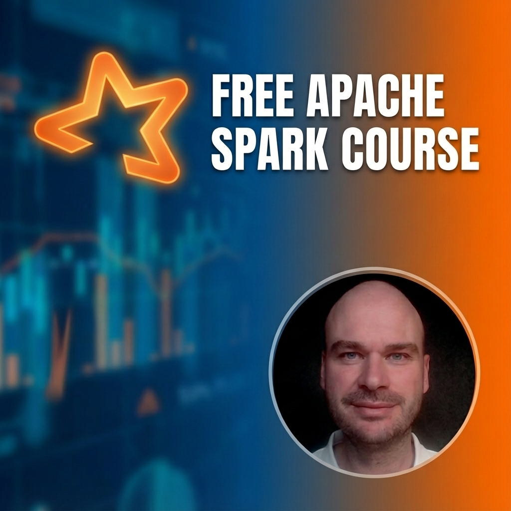

# Big Data Computing with Apache Spark

A hands-on Apache Spark course designed for Databricks, featuring DataFrames, SQL, aggregations, UDFs, performance optimization, and Delta Lake.

## About

This courseware is an improved version of [Databricks Academy's Apache Spark Programming course](https://github.com/databricks-academy/apache-spark-programming-with-databricks), originally released under [CC0 1.0 Universal](https://creativecommons.org/publicdomain/zero/1.0/).

**Key improvements:**
- Refocused on open-source Apache Spark (rather than Databricks-specific features)
- Enhanced pedagogical structure
- Updated for modern Spark versions

## Course Modules

| Module | Topics |
|--------|--------|
| 00 - Databricks Introduction | Platform basics, DBFS, widgets |
| 01 - Spark Core | DataFrames, Spark SQL, readers/writers |
| 02 - Aggregations and Functions | groupBy, window functions, UDFs, complex types |
| 03 - Tasks, Jobs and Stages | Spark execution model |
| Reference 1 - Performance | Query optimization, partitioning |
| Reference 2 - Delta Lake | Delta Lake fundamentals |

Each module includes lessons, hands-on labs, and solutions.

## Import to Databricks

1. In your Databricks workspace, go to **Repos**
2. Click **Add Repo**
3. Paste this repository URL:
   ```
   https://github.com/zoltanctoth/ceu-big-data-with-databricks-and-apache-spark-class
   ```
4. Click **Create Repo**

For detailed instructions, see [Databricks Repos documentation](https://docs.databricks.com/repos/index.html).

## Author

[Zoltan C. Toth](https://www.linkedin.com/in/zoltanctoth/)

## License

This work is licensed under [CC-BY-SA 4.0](https://creativecommons.org/licenses/by-sa/4.0/) (Attribution-ShareAlike).
Based on [Databricks Academy's Apache Spark Programming course](https://github.com/databricks-academy/apache-spark-programming-with-databricks) (CC0 1.0).
